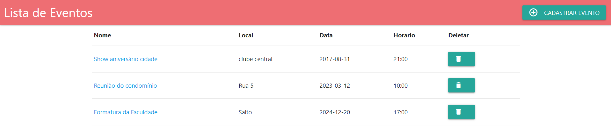

# Evento app

# Sobre o projeto

Aplicativo web <b>personalizado</b> contruído no intuíto de aprimorar o aprendizado sobre Spring boot e CRUD na linguagem Java

A aplicação consiste em ser um modelo de agenda, nele é possível Criar, atualizar e editar um evento, podendo também atribuir pessoas a esse mesmo evento

## Tecnologias 

- HTML / CSS / JS

- java
- Spring boot
- Maven
- JPA / Hibernate

- Git e Github

## Considerações

Se trata de um projeto inicial, apenas com técnicas básicas. Entretanto, foi de grande conhecimento adquirido com Spring boot e arquitetura MVC

## Contato 

igormivanovx@gmail.com

